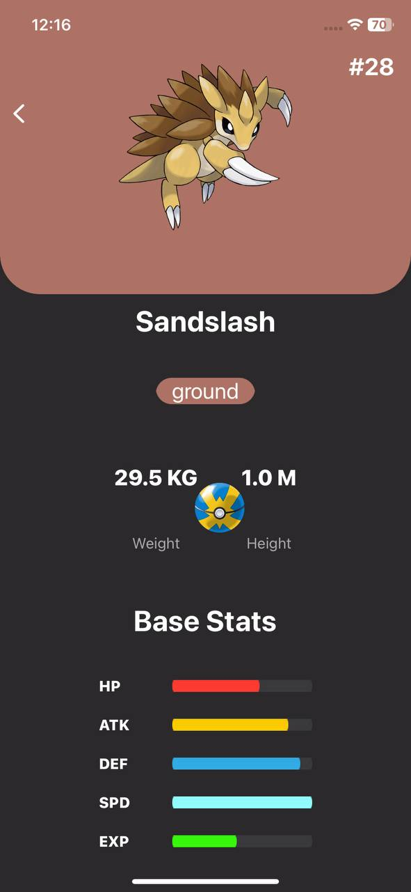
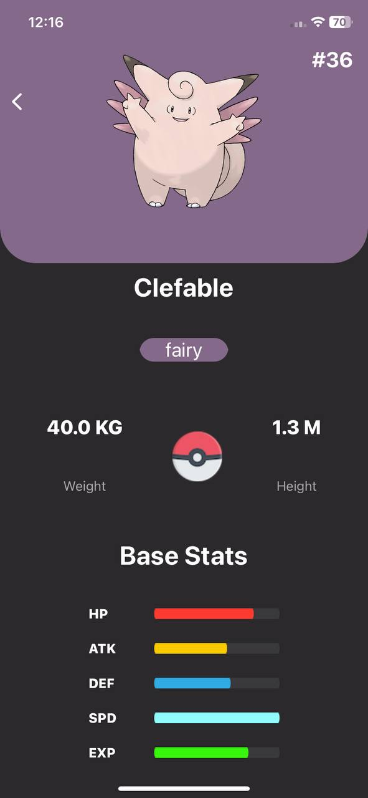
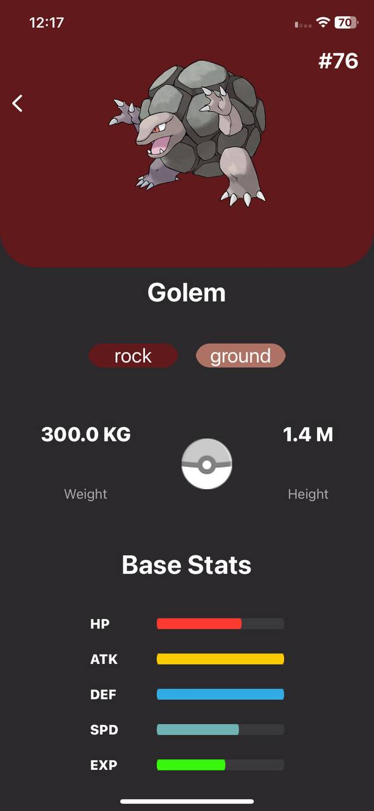
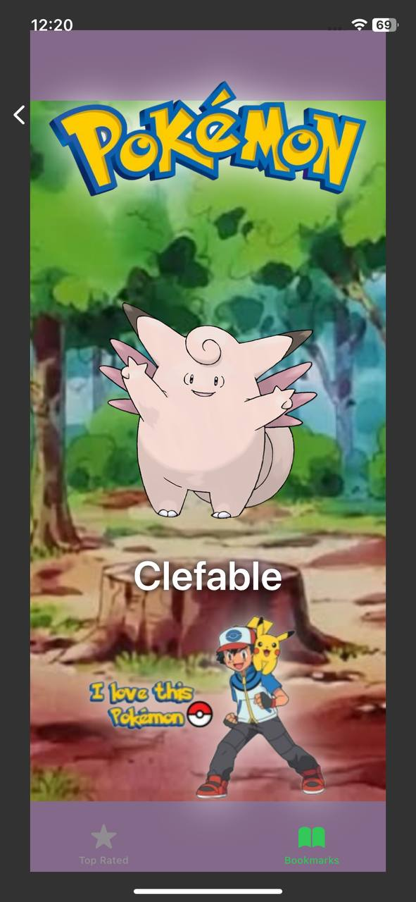

# MyPokeDex
MyPokéDex
<h1 align="center">🐹 MyPokéDex - iOS App</h1>

<p align="center"></p>

> The Pokédex (ポケモン図鑑ずかん, Pokemon Zukan, Illustrated Pokémon Encyclopedia) is an electronic device created and designed to catalog and provide information regarding the various species of Pokémon featured in the Pokémon video game, anime and manga series. The name Pokédex is a neologism including "Pokémon" (which itself is a portmanteau of "pocket" and "monster") and "index". The Japanese name is simply "Pokémon Encyclopedia", as it can feature every Pokémon on it, depending on the Pokédex. - <a href="https://pokemon.fandom.com/wiki/Pok%C3%A9dex" target="_blank">Pokemon Fandom Wiki</a>

##

**MyPokéDex** is a feature-packed Pokémon app that brings your favorite Pokémon to life with a sleek, user-friendly interface created in SwiftUI. It fetches data from the **PokéDex API** and displays a comprehensive list of Pokémon, their stats, and their most common items. With unique features like compositional layout, async image downloading, infinite scrolling, and more, MyPokéDex is built to deliver a polished user experience. The app is structured using the **MVVM architecture**.

---

## ✨ Features:

- 📐 **Compositional Layout**  
  Smooth and responsive grid and table views built with compositional layouts for a modern and flexible UI.

- 🖼️ **Asynchronous Image Downloading with Caching**  
  Pokémon images are fetched asynchronously and cached for faster performance and reduced data usage.

- 🌐 **Efficient Networking with Combine**  
  Pokémon data is retrieved from the **PokéDex API** using Combine, ensuring efficient and reactive data handling.

- 🧭 **Custom Navigation and Tab Bars**  
  Tailored navigation and tab bars offer a sleek, intuitive experience across the app.

- 🎬 **Seamless View Transitions**  
  Custom view transitions enhance the flow and visual appeal of the user interface.

- 🧱 **MVVM Architecture**  
  Built using the **Model-View-ViewModel (MVVM)** architecture for clean, scalable, and maintainable code.

- 🔁 **Infinite Scrolling**  
  Effortlessly scroll through the full list of Pokémon with built-in infinite scrolling.

- 🔤 **Custom Typography**  
  Designed with custom fonts to give the app a distinctive and engaging visual style.

- 🎨 **Dominant Color Integration**  
  Each Pokémon’s dominant sprite color is detected and used to enrich the UI, creating a more immersive experience.

---

## 🛠️ Installation:

To run this project locally:

1. Clone the repository:
    ```bash
    git clone https://github.com/deepanshubajaj/MyPokeDex.git
    ```

2. Open the project in Xcode:
    ```bash
    open PokedexApp.xcodeproj
    ```

3. Build and run the app on a simulator or physical device.

> Make sure you have Xcode installed and configured properly to run the project.

---

## ⚙️ API Reference:


Pokedex using the [PokéAPI](https://pokeapi.co/) for constructing RESTful API.<br>
PokeAPI provides a RESTful API interface to highly detailed objects built from thousands of lines of data related to Pokémon.

---

## 🎨 App Look:

<p align="center">
  
</p>
<p align="center">
  *App snapshot in the simulator.*
</p>

---

## 🖼️ Screenshots:

<p align="center">
  
  
</p>

<p align="center">
  *Splash screen displayed upon app launch.*
</p>


##


<p align="center">
  <div style="display: flex; justify-content: center; gap: 10px;">
    
    
    
  </div>
</p>

##

<p align="center">
  <div style="display: flex; justify-content: center; gap: 10px;">
    
    
    
  </div>
</p>

##

<p align="center">
  <div style="display: flex; justify-content: center; gap: 10px;">
    
    
    
  </div>
</p>

##

<p align="center">
  <div style="display: flex; justify-content: center; gap: 10px;">
    
    
    
  </div>
</p>

##

<p align="center">
  <div style="display: flex; justify-content: center; gap: 10px;">
    
    
    
  </div>
</p>

##

<p align="center">
  <div style="display: flex; justify-content: center; gap: 10px;">
    
    
    
  </div>
</p>

##

<p align="center">
  <div style="display: flex; justify-content: center; gap: 10px;">
    
    
    
  </div>
</p>

##

<p align="center">
  <div style="display: flex; justify-content: center; gap: 10px;">
    
    
    
  </div>
</p>

##

<p align="center">
  <div style="display: flex; justify-content: center; gap: 10px;">
    
    
    
  </div>
</p>

##

<p align="center">
  <div style="display: flex; justify-content: center; gap: 10px;">
    
    
    
  </div>
</p>

##

<p align="center">
  <div style="display: flex; justify-content: center; gap: 10px;">
    
    
    
  </div>
</p>

##

<p align="center">
  <div style="display: flex; justify-content: center; gap: 10px;">
    
    
    
  </div>
</p>

<p align="center">
  *Screenshots of the MyPokéDex app showing different screens*
</p>

---

## 📱 App Icon:

<p align="center">
  
</p>
<p align="center">
  *The app icon reflects the MyPokéDex look*
</p>

---

## 🚀 Video Demo:

Here’s a short video showcasing the app's functionality:

<p align="center">
  
  
</p>

➤ <a href="ProjectOutputs/WorkingVideo/splashScreen.mp4">🎬 Watch Splash Screen Video</a>

➤ <a href="ProjectOutputs/WorkingVideo/workingVideo.MP4">🎥 Watch Working Video 1</a>

➤ <a href="ProjectOutputs/WorkingVideo/workingVideo2.MP4">🎥 Watch Working Video 2</a>

---

## 🤝 Contributing

Thank you for your interest in contributing to this project!  
I welcome contributions from the community.

- You are free to use, modify, and redistribute this code under the terms of the **MIT License**.
- If you'd like to contribute, please **open an issue** or **submit a pull request**.
- All contributions will be reviewed and approved by the author — **[Deepanshu Bajaj](https://github.com/deepanshubajaj?tab=overview&from=2025-03-01&to=2025-03-31)**.

---

## 📃 License

This project is licensed under the [MIT License](./LICENSE).  
You are free to use this project for personal, educational, or commercial purposes — just make sure to provide proper attribution.

> **Clarification:** Commercial use includes, but is not limited to, use in products,  
> services, or activities intended to generate revenue, directly or indirectly.